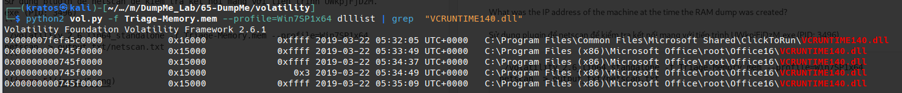

# Q1

What is the SHA1 hash of Triage-Memory.mem (memory dump)?
- để hash file sử dụng lệnh: sha1sum 'ten file'


=> c95e8cc8c946f95a109ea8e47a6800de10a27abd

# Q2
What volatility profile is the most appropriate for this machine? (ex: Win10x86_14393)


=> Win7SP1x64 (Hệ điều hành win 7 64 bit)

# Q3 
What was the process ID of notepad.exe?
- sử dụng plugin pstree để xem các tiến trình 
```
./volatility_2.6_lin64_standalone -f Triage-Memory.mem --profile=Win7SP1x64 pstree > output_txt/pstree.txt
```


=> PID 3032

# Q4
Name the child process of wscript.exe.


Ta dựa vào PID và PPID:
- PID là hệ số cấp cho 1 tiến trình duy nhất.
- PPID là hệ số  được cấp cho tiến trình cha.

Ở đây ta thấ y PPID của notepad.exe là 1432 
- Tiến trình cha explorer.exe (PID 1432)
- Tạo ra các tiến trình con: 
    - cmd.exe (PID: 1408)
    - chrome.exe (PID: 3248) 
    - ....
    - POWERPNT.EXE (PID: 4048) 
    - hfs.exe  (PID: 3952)
    - EXCEL.EXE  (PID: 1272) 

Khả năng cao đây là loại mã độc VBA marco

Tiến trình hfs.exe (PID: 3952)  tạo ra wscript.exe (PID: 5116) và tiến trình con UWkpjFjDzM.exe (PID: 3496) thực hiện tiến trình cmd (PID: 4660)

=> UWkpjFjDzM.exe

# Q5
What was the IP address of the machine at the time the RAM dump was created?

Sử dụng plugin để netscan để kiểm tra kết nối mạng với tiến trình UWkpjFjDzM.exe (PID: 3496)
```
./volatility_2.6_lin64_standalone -f Triage-Memory.mem --profile=Win7SP1x64 netscan  > output_txt/netscan.txt
```


=> 10.0.0.101 cổng 49217 

# Q6 
Based on the answer regarding the infected PID, can you determine the IP of the attacker?

=> 10.0.0.106 cổng 4444

# Q7
How many processes are associated with VCRUNTIME140.dll?

Ta sử dụng plugin dlllist để liệt kê dll và grep VCRUNTIME140.dll


=> 5
