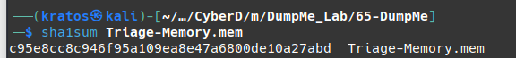

# Q1

What is the SHA1 hash of Triage-Memory.mem (memory dump)?
- để hash file sử dụng lệnh: sha1sum 'ten file'


=> c95e8cc8c946f95a109ea8e47a6800de10a27abd

# Q2
What volatility profile is the most appropriate for this machine? (ex: Win10x86_14393)


=> Win7SP1x64 (Hệ điều hành win 7 64 bit)

# Q3 
What was the process ID of notepad.exe?
- sử dụng plugin pstree để xem các tiến trình 
```
./volatility_2.6_lin64_standalone -f Triage-Memory.mem --profile=Win7SP1x64 pstree > output_txt/pstree.txt
```


=> PID 3032

# Q4
Name the child process of wscript.exe.


Ta dựa vào PID và PPID:
- PID là hệ số cấp cho 1 tiến trình duy nhất.
- PPID là hệ số  được cấp cho tiến trình cha.

Ở đây ta thấ y PPID của notepad.exe là 1432 
- Tiến trình cha explorer.exe (PID 1432)
- Tạo ra các tiến trình con: 
    - cmd.exe (PID: 1408)
    - chrome.exe (PID: 3248) 
    - ....
    - POWERPNT.EXE (PID: 4048) 
    - hfs.exe  (PID: 3952)
    - EXCEL.EXE  (PID: 1272) 

Khả năng cao đây là loại mã độc VBA marco

Tiến trình hfs.exe (PID: 3952)  tạo ra wscript.exe (PID: 5116) và tiến trình con UWkpjFjDzM.exe (PID: 3496) thực hiện tiến trình cmd (PID: 4660)

=> UWkpjFjDzM.exe

# Q5
What was the IP address of the machine at the time the RAM dump was created?

Sử dụng plugin để netscan để kiểm tra kết nối mạng với tiến trình UWkpjFjDzM.exe (PID: 3496)
```
./volatility_2.6_lin64_standalone -f Triage-Memory.mem --profile=Win7SP1x64 netscan  > output_txt/netscan.txt
```


=> 10.0.0.101 cổng 49217 

# Q6 
Based on the answer regarding the infected PID, can you determine the IP of the attacker?

=> 10.0.0.106 cổng 4444

# Q7
How many processes are associated with VCRUNTIME140.dll?

Ta sử dụng plugin dlllist để liệt kê dll và grep VCRUNTIME140.dll


=> 5

# Q8
After dumping the infected process, what is its md5 hash?
- Ta nghi ngờ UWkpjFjDzM.exe (PID: 3496) là file độc hại sử dụng plugin **procdump** để dump file ra

```
python2 vol.py -f Triage-Memory.mem --profile=Win7SP1x64 procdump -D ../output_file -p 3496
```
 

- Cho lên virustotal


Loại file độc hại là **trojan**, họ: **swrort, cryptz, marte**

=> 690ea20bc3bdfb328e23005d9a80c290

# Q9 
What is the LM hash of Bob's account?
- Sử dụng plugin **hashdump**. Để dump các hash mật khẩu 
```
 python2 vol.py -f Triage-Memory.mem --profile=Win7SP1x64 hashdump
```


=> aad3b435b51404eeaad3b435b51404ee:31d6cfe0d16ae931b73c59d7e0c089c0

# Q10
What memory protection constants does the VAD node at 0xfffffa800577ba10 have?
- VAD: Virtual Address Descriptors. Mỗi VAD là cấu trúc quản lý bộ nhớ ảo của tiến trình sử dụng: kích thức vùng nhớ, quyền truy cập,... 

```
python2 vol.py -f Triage-Memory.mem --profile=Win7SP1x64  vadinfo | grep -A 10 0xfffffa800577ba10 
```

=> PAGE_READONLY

# Q11
What memory protection did the VAD starting at 0x00000000033c0000 and ending at 0x00000000033dffff have?

```
python2 vol.py -f Triage-Memory.mem --profile=Win7SP1x64  vadinfo | grep  0x00000000033c0000
```


Có thể thấy địa chỉ bắt đầu **0x00000000033c0000** và địa chỉ kết thúc **0x00000000033dffff** thuộc vùng nhớ  **0xfffffa80052652b0**

```
python2 vol.py -f Triage-Memory.mem --profile=Win7SP1x64  vadinfo | grep -A 10 0xfffffa80052652b0
```


=> PAGE_NOACCESS

# Q12
There was a VBS script that ran on the machine. What is the name of the script? (submit without file extension)
- Sử dụng plugin cmdline: được sử dụng để tìm kiếm các dòng lệnh của các tiến trình khi được khởi động.
```
python2 vol.py -f Triage-Memory.mem --profile=Win7SP1x64  cmdline > ../output_txt/cmdline.txt 
```


=> vhjReUDEuumrX

# Q13
An application was run at 2019-03-07 23:06:58 UTC. What is the name of the program? (Include extension)

- Sử dụng plugin shimcache: plugin này lưu trữ thông tin về các tệp thực thi: thời gian sửa đổi, đường dẫn tuyệt đối. 
```
python2 vol.py -f Triage-Memory.mem --profile=Win7SP1x64  shimcache > ../output_txt/shimcache.txt
```


=> Skype.exe

# Q14
What was written in notepad.exe at the time when the memory dump was captured?
```
 python2 vol.py -f Triage-Memory.mem --profile=Win7SP1x64  memdump -p 3032 --dump-dir=../output_file
```


# Q15 
What is the short name of the file at file record 59045?
- Sử dụng plugin mftparser  kiểm tra MFT để thấy tên ngắn của tệp tin.
MFT: masster file table. Chứa dữ liệu về tất cả những thông tin về tệp tin, thư mục trong windows. (Tệp đã bị xóa nhưng chưa bị ghi đè thì bản ghi vẫn còn được lưu lại)

```
python2 vol.py -f Triage-Memory.mem --profile=Win7SP1x64  mftparser > ../output_txt/mftparser.txt
```

Sử dụng lệnh để xem recỏd 59045
```
 strings mftparser.txt | grep -A 20 59045
```


=> EMPLOY~1.XLS

# Q16
This box was exploited and is running meterpreter. What was the infected PID?
=> 3496 (PID của tiến trình UWkpjFjDzM.exe)