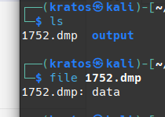
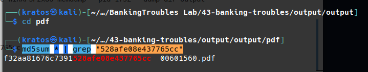

XÁC ĐỊNH PROFILE
 - Sử dụng imageinfo để tìm profile
 ```
 ./volatility_2.6_lin64_standalone -f Bob.vmem imageinfo
 ```
 
 - Profile: WinXPSP2x86
 -------------------------------------------------
 Network connections
 - Sử dụng connections để xem các kết nối mạng cũng như là các kết nối đáng ngờ
 ```
 ./volatility_2.6_lin64_standalone -f Bob.vmem connections
 ```
 
 - Q1: What was the local IP address of the victim's machine? 192.168.0.176
 --------------------------------------------------
 Kiểm tra biến môi trường của hệ điều hành.
 - Sử dụng envars để kiểm tra biến môi trường. 
```
./volatility_2.6_lin64_standalone -f Bob.vmem envars > envars.txt
```

- Q2: What was the OS environment variable's value? Windows_NT
------------------------------------------------------
Lấy thông tin tài khoản admin
- sử dụng hashdump để lấy thông tin đã hash, sau đó có thể sử dụng các công cụ như hashcat để crack mật khẩu
```
 ./volatility_2.6_lin64_standalone -f Bob.vmem hashdump > hashdump.txt
```

- Q3: What was the Administrator's password? password 
-------------------------------------------------------
Enumerating Processes
- Sử dụng pslist để xem các tiến trình. 
```
./volatility_2.6_lin64_standalone -f Bob.vmem --profile WinXPSP2x86 pslist > pslist
```

- Ở đây ta thấy tiến trình AcroRD32.exe. Tiến trình của Adobe Acrobat Reader, một phần mềm phổ biến được sử dụng để xem, in và chú thích các tài liệu PDF

Q4: Which process was most likely responsible for the initial exploit? AcroRD32.exe

Q5: What is the extension of the malicious file retrieved from the process responsible for the initial exploit? PDF

Q6: Suspicious processes opened network connections to external IPs. One of them starts with "2". Provide the full IP.
- Tiến trình AcroRD32.exe có PID là 888 

- Ip: 212.150.164.203
-----------------------------------------------------
Q7: A suspicious URL was present in process svchost.exe memory. Provide the full URL that points to a PHP page hosted over a public IP (no FQDN). 
- Sử  dụng: strings Bob.vmem | grep -F '.php' | grep '^http:' để kiểm tra

=> http://193.104.22.71/~produkt/9j856f_4m9y8urb.php
------------------------------------------------------------
Q8: Extract files from the initial process. One file has an MD5 hash ending with "528afe08e437765cc". When was this file first submitted for analysis on VirusTotal?
- dump file 
```
./volatility_2.6_lin64_standalone -f Bob.vmem --profile WinXPSP2x86 memdump --pid 1752 --dump-dir=output
```
- kiem tra loai file

- Loai file nghi ngo la .pdf cd vao no 
- Su dung lenh de tim kiem file co ma MD5 528afe08e437765cc
```
md5sum * | grep "528afe08e437765cc"
```

- Ten file  00601560.pdf
Q9 What was the PID of the process that loaded the file PDF.php? 1752