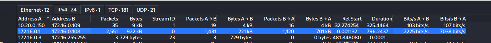
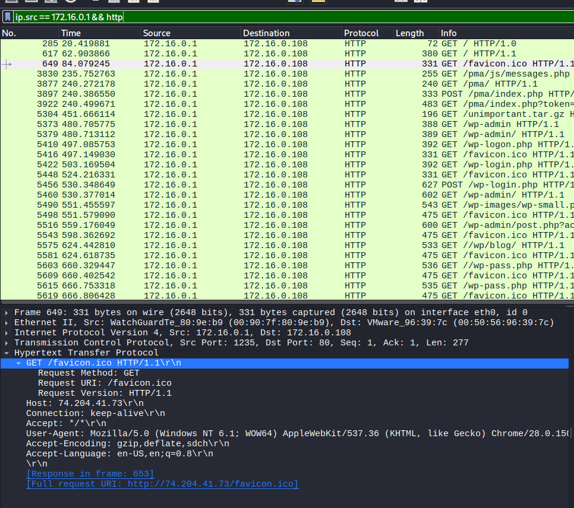
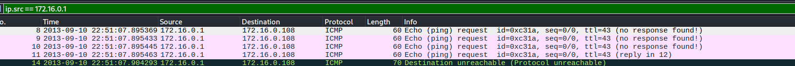
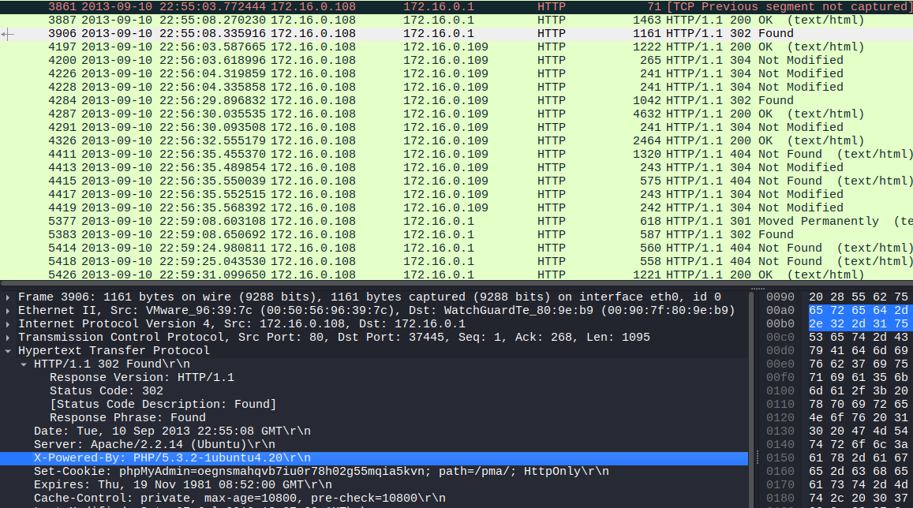
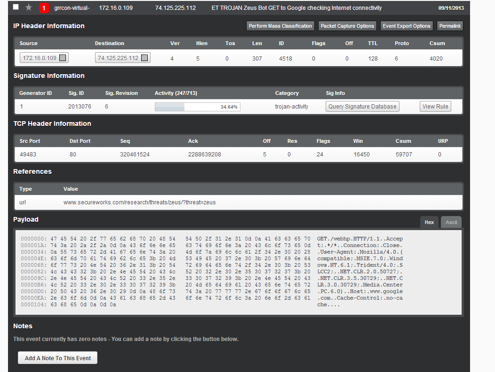
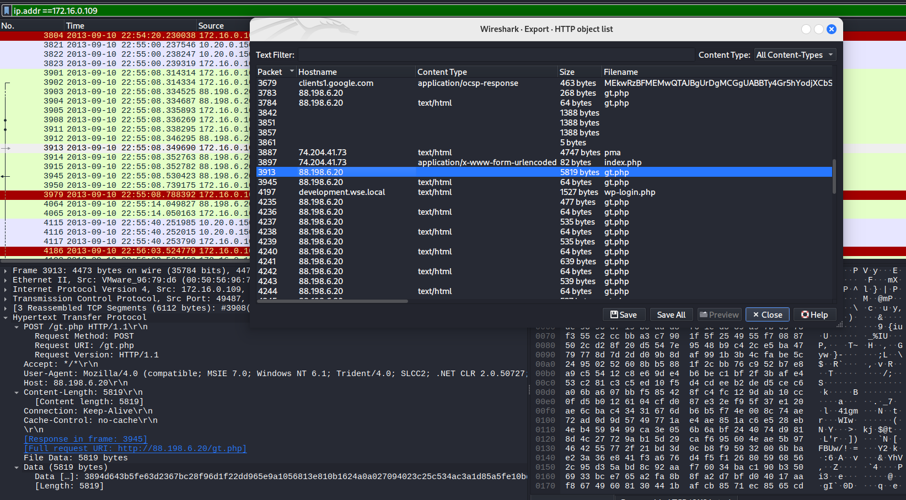
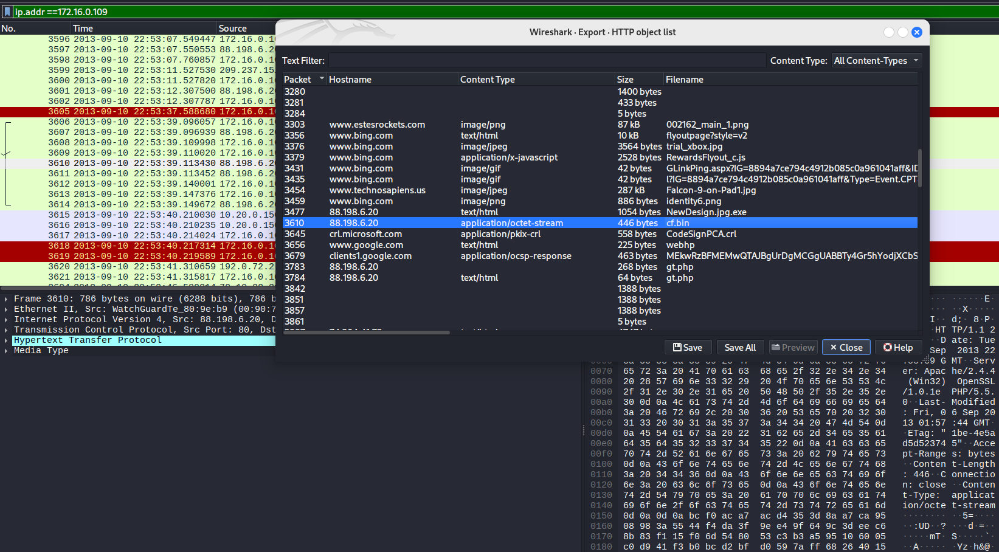

Q1: PCAP: Development.wse.local is a critical asset for the Wayne and Stark Enterprises, where the company stores new top-secret designs on weapons. Jon Smith has access to the website and we believe it may have been compromised, according to the IDS alert we received earlier today. First, determine the Public IP Address of the webserver?

- Dia chi 172.16.0.1 gui 14311 goi tin den 176.16.0.108
- ip.src == 172.16.0.1 && http

=> 74.204.41.73
------------------------------------------------------------------------

Q2: PCAP: Alright, now we need you to determine a starting point for the timeline that will be useful in mapping out the incident. Please determine the arrival time of frame 1 in the "GrrCON.pcapng" evidence file.

- ip.src == 172.16.0.1

=> 22;51;07 UTC
---------------------------------------------------------------------------

Q3: PCAP: What version number of PHP is the development.wse.local server running?
- ip.src == 172.16.0.108 && http

=> 5.3.2
------------------------------------------------------------------------------
Q4: PCAP: What version number of Apache is the development.wse.local web server using?
=> Apache/2.2.14 (Ubuntu)

-------------------------------------------------------------------------------

Q5: IR: What is the common name of the malware reported by the IDS alert provided?

=> zeus

--------------------------------------------------------------------------------

Q7: PCAP: Please identify the Gateway IP address of the LAN because the infrastructure team reported a potential problem with the IDS server that could have corrupted the PCAP

=> 172.16.0.1

------------------------------------------------------------------------------

Q8: IR: According to the IDS alert, the Zeus bot attempted to ping an external website to verify connectivity. What was the IP address of the website pinged?
ip.src == 172.16.0.109

=> 88.198.6.20 

-------------------------------------------------------------------------------
Q9: PCAP: The infrastructure team also requests that you identify the filename of the “.bin” configuration file that the Zeus bot downloaded right after the infection. Please provide the file name?

=> cf.bin

--------------------------------------------------------------------------------