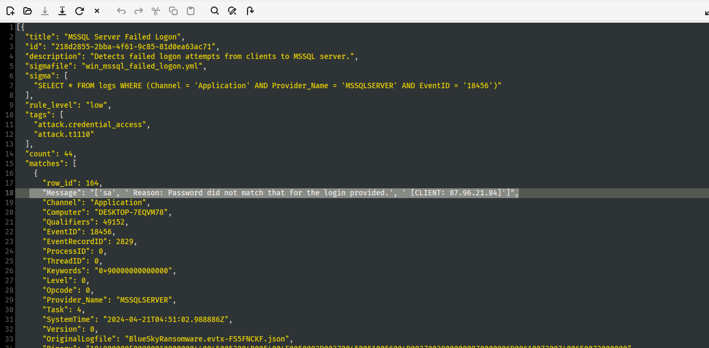
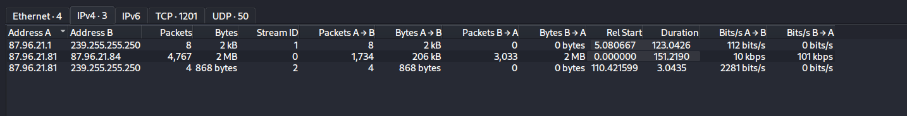
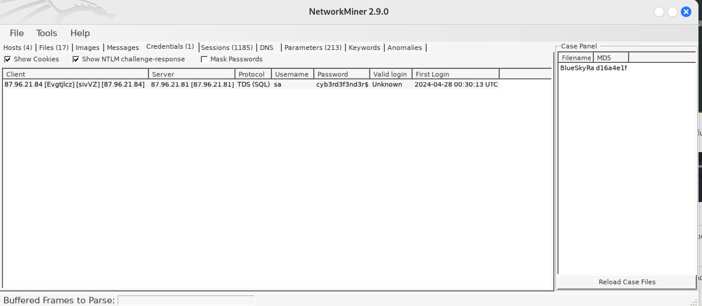
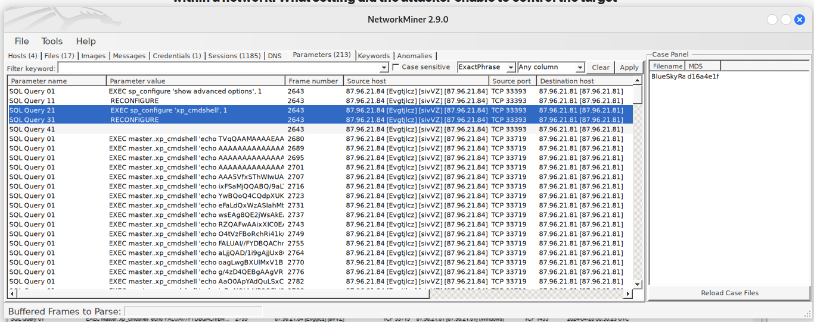
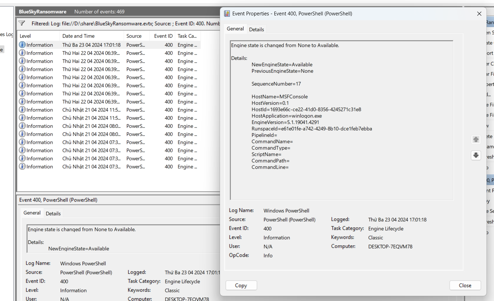

Q1: Knowing the source IP of the attack allows security teams to respond to potential threats quickly. Can you identify the source IP responsible for potential port scanning activity?

- Su dung zircolite de phan tich events. Zircolite tim kiem duoc: MSSQL Server Failed Logon [low] : 44 events
- Su dung wireshark de doc file pcap. 

=> IP: 87.96.21.84
------------------------------------------------------------------------------
Q2: During the investigation, it's essential to determine the account targeted by the attacker. Can you identify the targeted account username?
=> sa

-------------------------------------------------------------------------------
Q3: We need to determine if the attacker succeeded in gaining access. Can you provide the correct password discovered by the attacker?
- tiep tuc su dung NetworkMiner de kiem tra

=> cyb3rd3f3nd3r$

-------------------------------------------------------------------------------
Q4: Attackers often change some settings to facilitate lateral movement within a network. What setting did the attacker enable to control the target host further and execute further commands?
- Lệnh EXEC sp_configure 'xp_cmdshell', 1 được sử dụng trong SQL Server để kích hoạt tính năng xp_cmdshell, một stored procedure mở rộng cho phép thực thi các lệnh hệ điều hành thông qua SQL Server. 

=> xp_cmdshell

------------------------------------------------------------------------------
Q5: Process injection is often used by attackers to escalate privileges within a system. What process did the attacker inject the C2 into to gain administrative privileges?

- msfconsole la metasploit
=> winlogon.exe

------------------------------------------------------------------------------
